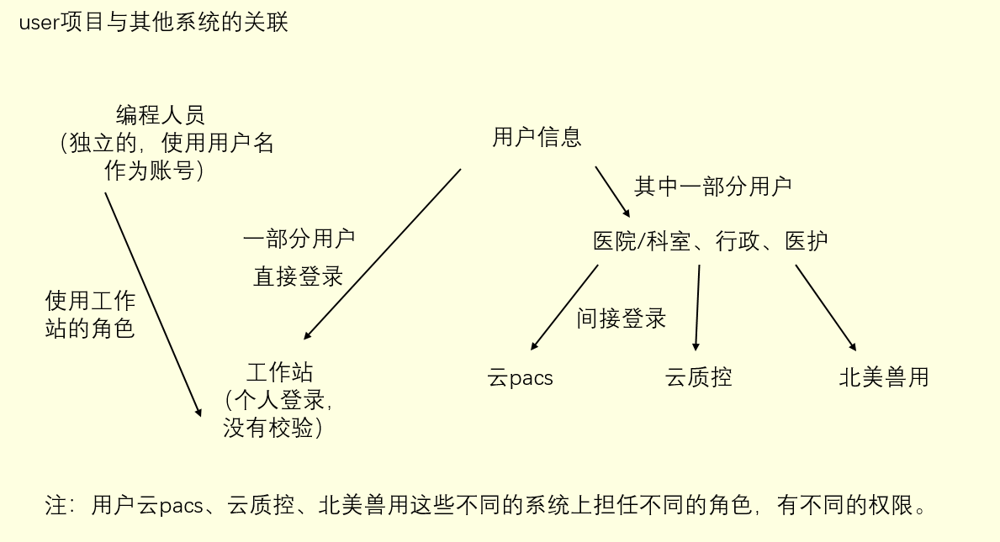

[TOC]


# 项目总览

user 项目对应系统：后台管理系统   

user 项目的三大功能模块：用户、权限、校验。   

权限功能有两种方式认证：Security、Zuul.

项目中的实体分层情况：
**医院 -> 科室 -> 系统 这么分层的。**
**一个用户在不同的系统中可能对应不同的医院，所以一个用户会对应多个医院。**
**用户在一个医院下能有多个角色，因为关联不同的科室和系统，一个角色会对应有多个权限，即拥有多种功能。**  
**同一个医院下可能会有多个相同的角色，对应不同的科室。如科室主任，不同科室都会有科室主任这个角色。**   
**如果一个用户，在医院内关联了多个科室，可能会有多条记录，因为查询结果里，roleId 不一样，角色跟科室关联。**  
**查询一个用户在某医院内的某个科室下的角色，也可能会有多条记录，因为可能有不同的系统。**

**各系统 id：1 华声云、2 云 PACS、3 云客服、4 后台管理、5 前置机、6 云质控、7 行政质控中心、8 医联体质控中心**  


# user 项目与其他系统的关联
<div align="center"></div>


# 项目中对数据库表的操作

## 对数据库表的 CRUD

在项目中，对于 user_center 数据库中表的对应实体类以及对应的增删改查并不是手动写的，而是通过 mybatis-generator 自动生成的。  

这部分的配置本来是通过在项目 pom 文件中引入依赖，但是在 user 项目中实际上是通过 `exec-maven-plugin` 插件去引用 db 项目，而依赖也是在 db 项目中引入的。之所以这么设计，我的理解是因为有其他微服务项目比如云 pacs 也会需要自动生成数据库中表对应实体以及对应 CRUD，因此将其单独弄成一个项目。  

`exec-maven-plugin` 插件配置如下：  
```xml
<plugin>
    <groupId>org.codehaus.mojo</groupId>
    <artifactId>exec-maven-plugin</artifactId>
    <version>1.6.0</version>
    <executions>
        <execution>
            <phase>generate-sources</phase>
            <goals>
                <goal>java</goal>
            </goals>
        </execution>
    </executions>
    <configuration>
        <mainClass>com.wisonic.db.DatabaseVersionControl</mainClass>
        <cleanupDaemonThreads>false</cleanupDaemonThreads>
        <arguments>
            <argument>user</argument>
            <argument>com.wisonic.user</argument>
            <argument>false</argument>
            <argument>com.wisonic.db.plugin.DefaultPlugin</argument>
            <argument>${env}</argument>
            <argument>conditional</argument>
        </arguments>
    </configuration>
</plugin>
```
可以看到，这个插件其实也调用 db 项目的主类去运行，`<arguments>`中就是其中的主类方法的参数，数据库表的实体类和 CRUD 就是运行这个主类生成的。   

对于 mybatis-generator 自动生成，会生成以下三个文件夹：
1. model：位于 com.wisonic.user.dao.model，里面有两种文件：一种以数据库表名作为文件名，它对应表的实体类；另一种是以 Example 作为后缀的文件，是用于构建动态查询条件的实用工具类，详细介绍看后文。
2. mapper：位于 com.wisonic.user.dao.mapper，是操作数据库表的接口，定义了 CRUD 方法，与 xml 文件对应。
3. xml：位于 com.resources.mapper.generator，是实际操作数据库的 SQL 语句，与接口方法对应。

### mapper 下以 Example 作为后缀的文件是什么？
它是用于构建动态查询条件的实用工具类，提供了一种方便的方式来构建 MyBatis 查询语句的条件部分。   

它们通常包含了一系列的方法和属性，用于设置查询条件，例如 where 子句中的各种条件（等于、大于、小于、模糊匹配等）。通过使用 Example 类，可以在不写 SQL 语句的情况下动态构建查询条件，并且可以避免 SQL 注入等安全问题。  

通常，这些 Example 类的使用流程是：
1. 创建一个 Example 对象。
2. 使用 Example 对象的各种方法来设置查询条件，比如设置属性的值、添加查询条件等。
3. 将 Example 对象传递给相应的 MyBatis Mapper 方法，以生成查询语句并执行查询。

这样做的好处是可以在编程时更加灵活地构建查询条件，而无需手动编写复杂的 SQL 语句，同时也提高了代码的可读性和可维护性。


## 对数据库的版本更新

一般对数据库进行了版本更新是因为对数据库表结构进行了修改或者新增了表。数据库的版本更新是通过 flyway 的，而 flyway 更新有两种方式：一种是 SQL 的方式，一种是 JDBC 的方式。  

### SQL 方式更新数据库
- 原理：使用 SQL 脚本来描述数据库的结构变更。这些 SQL 脚本包含了创建表、修改表结构、插入数据等数据库操作。
- 特点：简单、易读，开发者可以直接在 SQL 文件中编写需要执行的数据库脚本。这种方式适合大多数简单和标准的数据库变更操作。
- 使用场景：适用于相对简单的数据库变更，特别是那些可以通过 SQL 语句轻松表示的变更。
- 项目中位置：resources.db.migration。

### JDBC 方式更新数据库
- 原理：支持使用编程语言（通常是 Java）编写数据库变更脚本，这些脚本通过 JDBC 连接到数据库执行。
- 特点：灵活，可以通过编程语言的控制结构实现更为复杂的逻辑。这种方式适用于那些需要在变更过程中执行一些复杂逻辑的情况。
- 使用场景：适用于那些复杂的数据库变更，需要在变更过程中执行一些额外的逻辑或者需要动态生成 SQL 语句的情况。
- 项目中位置：db.migration。注意在 db 文件夹下的是对应版本的一个枚举类，主要用于准备数据用于插入数据表中。

对于 JDBC 方式更新数据库，需要遵循一定的规范：  
1. 继承 `BaseJavaMigration` 抽象类，这是为实现基于 java 的迁移而扩展的推荐类。
2. 子类应该遵循默认的 Flyway 命名约定，类名的结构如下:
   - 版本化迁移：`V2__Add_new_table`，一般是这个。
   - 撤销迁移: `U2__Add_new_table`
   - 可重复迁移：`R__Add_new_table`  


# 系统路由地址获取

项目启动时要先获取各个系统的路由地址，并存到 Redis 缓存中。对应加载代码在 `config.RouteInfoConfig` 中，对应的路由地址信息存在于数据库 `route_info` 表中，每个系统会包含多个路由地址。   

在这个过程中，有三个点是值得注意的：  
1. 对于数据库的操作。上面说了项目中对于数据库中的操作是由 mybatis-generator 自动生成的，所以代码中的 CRUD 语法跟以前所学不太一样。具体是  
    ```java
    // 1.通过 Example 类生成查询的条件
    mbgRouteInfoExample.createCriteria().andApplicationIdEqualTo(applicationId.getValue());
    // 2.再跟以前一样通过 mapper 来查询，只是要通过 Example 实例传入查询条件
    List<MbgRouteInfo> mbgRouteInfos = mbgRouteInfoMapper.selectByExample(mbgRouteInfoExample);
    ```

2. DO 与 Entity 之间的转换。这个转换是通过 MapStruct 来转换的，它是一个 Java 映射框架，在接口上使用 `@Mapper` 注解，可以自动生成该接口的实现类，实现 Entity-DO 各种模型之间的转换。若没有指定映射规则，则会按 MapStruct 默认的映射规则转换。也可以自己手动转换，项目中就是手动转换的。`@Mapper(componentModel = "spring")` 意思是将返回的实例存到 spring 容器中作为 bean。

3. 对于缓存的处理。项目中是先删除旧缓存，再进行更新。


# 用户管理接口

用户管理接口在 UserController 中。

## 创建用户

创建用户主要是要进行数据类型的转换以及插入表。    
- 数据类型转换：接口接收的请求体是 `CreateUserRequest`，需要转换成各个表所对应的实体类。
- 插入表：主要是要插入 `user_info`、`user_password`、`role_user_hospital`、`user_hospital` 这四张表。

其中，值得注意的重点是用户与医院、角色、权限之间的关系。 


# 角色和授权管理接口

角色和授权管理接口在 AuthorizationController 中，它对应的是后台管理系统中用户中心模块。   

## 华声云后台管理系统发起请求后的请求处理路径

以权限列表获取华声云权限为例。请求 url 为 https://t.wisonic.com/api/bgmgr/authority?appId=1。  

1. 请求发起后会先通过 zuul 网关，网关将请求转发到 backgroundmanager 微服务，调用其 `"/authority"` 对应的 Controller 方法。在 Controller 方法中，调用 Service 层的 `getAuthorities(Integer appId)` 方法。在该方法中，通过 FeignClient 去发 HTTP 请求做远程调用，请求对应 user-center 微服务。
2. 远程调用请求 user-center 微服务中的 AuthorizationController 的对应方法，在方法中，调用对应 Service 层的 `getAuthorities()` 方法获取权限，进而调用 dao 层的`CustomRoleMapper` 的 `findAuthoritiesByApplicationId()` 去查 **`authority_info`** 表。注意，该 Mapper 是自己定义的，不是自动生成的。


## 同步华声云权限（该功能已经不用了）
- authorityName：原来的权限名
- actionName：更新后的权限名  
- ActionUpdateDTO：更新后某系统所拥有的全部权限


对于要更新的权限，包括了需要添加进数据库的权限，需要从数据库删除的权限，由于模块名不一样而要进行修改的权限。  


## 创建某个医院的角色
逻辑有点奇怪，传入的是 `CreatePacsRoleRequest`，在处理过程中又固定了 `applicationId` 是华声云。

## 删除角色下的某个用户
如果传入的参数中有 `hospitalId`，则在 role_user_hospital 表中删除，如果没有传入 `hospitalId`，则在 user_role 表中删除。  

按理来说，不应该两张表都需要处理吗？为什么只处理了一张表？  
回答：role_user_hospital 和 user_role 是不同系统的角色表，role_user_hospital 是云PACS 系统的角色，user_role 是工作站的角色。  


# 关于自定义的 Mapper

在项目中，除了用 mybatis-generator 自动生成的 Mapper 之外，还有自己定义的 Mapper，主要是用来进行联表的查询。   

## Mapper.xml 中的 resultMap 已经用了已经定义好的模型类，为什么还需要`<constructor>` 标签定义参数？

在 MyBatis 中，Mapper.xml 中的 resultMap 既可以使用已经定义好的模型类，也可以通过 `<constructor>` 标签定义参数。这样做的主要目的是为了更灵活地映射查询结果到 Java 对象。   

使用已定义的模型类作为 resultMap 的类型有以下优势：
1. 简化配置： 如果数据库查询返回的列与模型类的属性完全对应，可以直接使用已定义的模型类，无需额外配置 resultMap。
2. 类型安全： 使用模型类可以提供类型安全，编译器可以检查属性和方法的正确性，减少错误发生的可能性。

然而，有时数据库查询的结果可能并不直接对应模型类的属性，或者需要进行一些额外的转换或处理，这时就需要使用 `<constructor>` 标签定义参数了。通过 `<constructor>` 标签，可以自定义结果映射的构造函数参数，使得可以在查询结果与模型类之间进行灵活的映射转换。

使用 `<constructor>` 标签定义参数的情况包括： 
- 数据库查询结果与模型类属性不完全对应：如果查询结果的列名与模型类的属性名不完全匹配，或者需要进行一些计算或转换，可以通过 `<constructor>` 标签定义参数进行映射。
- 构造函数参数类型不匹配：如果模型类的构造函数参数类型与数据库查询结果的列类型不完全匹配，需要进行类型转换或其他处理时，可以使用 `<constructor>` 标签定义参数。
- 需要排除某些字段或进行特殊处理：有时可能需要排除某些字段，或者对某些字段进行特殊处理，此时也可以通过 `<constructor>` 标签实现。

```xml
<resultMap id="RoleInfo" type="com.wisonic.user.dao.model.MbgRoleInfo">
    <constructor>
        <idArg column="id" javaType="java.lang.Long" jdbcType="BIGINT"/>
        <arg column="role_name" javaType="java.lang.String" jdbcType="VARCHAR"/>
        <arg column="description" javaType="java.lang.String" jdbcType="VARCHAR"/>
        <arg column="create_time" javaType="java.util.Date" jdbcType="TIMESTAMP"/>
        <arg column="update_time" javaType="java.util.Date" jdbcType="TIMESTAMP"/>
        <arg column="application_id" javaType="java.lang.Integer" jdbcType="INTEGER"/>
        <arg column="is_default" javaType="java.lang.Boolean" jdbcType="TINYINT"/>
    </constructor>
</resultMap>
```

## 数据库在执行联表查询时是先联表还是先根据查询条件筛选?

在数据库执行联表查询时，一般情况下，会先根据查询条件筛选数据，然后再进行联表操作。这是因为数据库优化器会根据查询条件和表之间的关联关系来确定最优的执行计划。

通常的执行顺序包括：
1. 查询条件筛选（Where Clause）： 数据库会首先根据查询条件进行筛选，以减少需要处理的数据量。这可以通过索引加速查询，提高查询效率。数据库会根据条件利用索引定位到匹配的行，并将这些行作为初始结果集。
2. 联表操作（Join）： 一旦获得了初始结果集，数据库会根据查询语句中的联表操作来进行表之间的连接。这包括内连接、外连接等不同类型的联接操作，根据查询语句中指定的联接条件来确定如何将不同表中的数据连接在一起。
3. 返回结果（Select）： 最后，数据库会根据查询语句中的 Select 子句，选择需要返回的列，并生成最终的查询结果。

然而，并不是所有的情况都是这样的，有时候数据库优化器可能会根据查询语句的复杂度和数据分布情况采取其他的执行策略。但通常来说，先筛选数据再进行联表操作是常见的执行顺序。


## CustomRoleMapper 中的联表查询

### findRoles
- 参数：`applicationId`、`hospitalId`
- 功能：查询指定系统下指定医院的所有角色信息
- 涉及的表：role_info、role_hospital
- 联表字段：`role_hospital.role_id = role_info.id`

### findRolesByDepartment
- 参数：`departmentId`、`value`
- 功能：查询指定系统下指定科室的所有角色信息
- 涉及的表：role_info、role_hospital
- 联表字段：`role_hospital.role_id = role_info.id`

### findAuthoritiesByRoleId
- 参数：`roleId`
- 功能：查询某个角色拥有的全部权限
- 涉及的表：authority_info、role_authority
- 联表字段：`authority_info.id = role_authority.authority_info_id`

### findAuthoritiesByRoleIds
- 参数：`List<Long> roleIds`
- 功能：查询某些角色拥有的全部权限
- 涉及的表：authority_info、role_authority
- 联表字段：`authority_info.id = role_authority.authority_info_id`

### findUserByRoleId
- 参数：`roleId`
- 功能：查询某个角色对应的所有用户
- 涉及的表：user_info、user_role
- 联表字段：`user_role.user_id = user_info.uuid`

### findRolesByDepartmentAndName
- 参数：`departmentId`、`name`、`applicationId`
- 功能：根据医院科室和角色名查询角色详细信息
- 涉及的表：role_info、role_hospital
- 联表字段：`role_hospital.role_id = role_info.id`

### findByHospitalAndUser
- 参数：`hospitalId`、`userId`
- 功能：根据医院和用户查找角色具体信息，因为结果可能会对应不同系统（或不同科室）下的，所以返回的是列表
- 涉及的表：role_info、role_user_hospital
- 联表字段：`role_info.id = role_user_hospital.role_info_id`

### findByDepartmentAndUser
- 参数：`departmentId`、`userId`
- 功能：根据科室和用户查找角色具体信息，因为在 sql 中固定了 `applicationId = 2`，所以查询的是云 PACS 下的角色。
- 涉及的表：role_info、role_user_hospital
- 联表字段：`role_info.id = role_user_hospital.role_info_id`


## CustomUserMapper 中的联表查询

### loadUser
- 参数：`principal`，表示账号名，它可以是用户 id 或者手机号
- 功能：根据用户 id 或者用户号码查询用户的账号密码
- 涉及的表：user_info、user_phone_number、user_password
- 联表字段：`user_info.uuid = user_phone_number.user_id`、`user_info.uuid = user_password.user_id`

### searchUserLimit
- 参数：`title` 指的是匹配规则、`allUser` 指的是是否算上已逻辑删除的用户
- 功能：根据匹配规则查询用户名或用户号码符合匹配规则的用户信息、电话、所属医院，结果限20条
- 涉及的表：user_info、user_phone_number、user_hospital
- 联表字段：`user_info.uuid = user_phone_number.user_id`、`user_info.uuid = user_hospital.user_id`

### searchUser
- 参数：`title` 指的是匹配规则、`allUser` 指的是是否算上已逻辑删除的用户
- 功能：根据匹配规则查询用户名或用户号码符合匹配规则的用户信息、电话、所属医院
- 涉及的表：user_info、user_phone_number、user_hospital
- 联表字段：`user_info.uuid = user_phone_number.user_id`、`user_info.uuid = user_hospital.user_id`

### searchWithUserId
- 参数：`title`、`allUser`、`userIds`
- 功能：根据匹配规则查询用户名或用户号码符合匹配规则的用户信息、电话、所属医院，或者包含在某些用户 id 内的用户信息、电话、所属医院。
- 涉及的表：user_info、user_phone_number、user_hospital
- 联表字段：`user_info.uuid = user_phone_number.user_id`、`user_info.uuid = user_hospital.user_id`

### queryUnAssociatedUserByHospital
- 参数：`departmentId`、`query` 指的是匹配规则
- 功能：查询科室未关联并且用户名或者用户号码符合匹配规则的用户列表
- 涉及的表：user_info、user_phone_number、role_user_hospital
- 联表字段：`user_info.uuid = user_phone_number.user_id`、`user_info.uuid = role_user_hospital.user_id`

### queryUser
- 参数：`departmentId`、`query` 指的是匹配规则
- 功能：获取指定科室中用户名或者用户号码符合匹配规则的用户列表
- 涉及的表：user_info、user_hospital、user_phone_number
- 联表字段：`user_info.uuid = user_hospital.user_id`、`user_info.uuid = user_phone_number.user_id`

### queryUserFromHospital
- 参数：`hospitalId`、`query`
- 功能：获取医院的用户列表
- 涉及的表：user_info、user_phone_number、uer_hospital
- 联表字段：`user_info.uuid = user_hospital.user_id`、`user_info.uuid = user_phone_number.user_id`

### queryByPhone
- 参数：`phone`
- 功能：通过手机号精确查找到用户
- 涉及的表：user_info、user_phone_number
- 联表字段：`user_info.uuid = user_phone_number.user_id`

### queryUserByName
- 参数：`name`
- 功能：通过用户名称模糊查询你用户
- 涉及的表：user_info、user_phone_number
- 联表字段：`user_info.uuid = user_phone_number.user_id`

### queryUserByPhone
- 参数：`phone`
- 功能：通过手机号模糊匹配查询用户
- 涉及的表：user_info、user_phone_number
- 联表字段：`user_info.uuid = user_phone_number.user_id`

### query
- 参数：`query`
- 功能：通过用户名或电话号码模糊匹配查询用户列表
- 涉及的表：user_info、user_phone_number
- 联表字段：`user_info.uuid = user_phone_number.user_id`

### queryByRoleId
- 参数：`roleId`
- 功能：通过用户组 id 和查询参数查询用户列表（通过角色 Id 查询用户列表）
- 涉及的表：user_info、user_phone_number、user_role
- 联表字段：`user_info.uuid = user_phone_number.user_id`


## QcCenterUserMapper 中的联表查询

### queryUserFromDistrictQcCenter
- 参数：`districtQcCenterId`、`query`——查询关键字
- 功能：获取行政质控中心用户列表
- 涉及的表：user_info、user_phone_number、user_role_district_qc_center、role_info
- 联表字段：`user_info.uuid = user_phone_number.user_id`、`user_info.uuid = user_role_district_qc_center.user_id`、`user_role_district_qc_center.role_id = role_info.id`

### queryNotAssociatedUserOfDistrictQcCenter
- 参数：`districtQcCenterId`、`query`
- 功能：获取行政质控中心未关联的用户列表
- 涉及的表：user_info、user_phone_number、user_role_district_qc_center
- 联表字段：`user_info.uuid = user_phone_number.user_id`、`user_info.uuid = user_role_district_qc_center.user_id`

### queryUserFromMtcQcCenter
- 参数：`mtcQcCenterId`、`query`
- 功能：获取医联体质控中心用户列表
- 涉及的表：user_info、user_phone_number、user_role_mtc_qc_center、role_info
- 联表字段：`user_info.uuid = user_phone_number.user_id`、`user_info.uuid = user_role_mtc_qc_center.user_id`、`user_role_mtc_qc_center.role_id = role_info.id`

### queryNotAssociatedUserOfMtcQcCenter
- 参数：`mtcQcCenterId`、`query`
- 功能：获取医联体质控中心未关联的用户列表
- 涉及的表：user_info、user_phone_number、user_role_mtc_qc_center
- 联表字段：`user_info.uuid = user_phone_number.user_id`、`user_info.uuid = user_role_mtc_qc_center.user_id`


## UserMapper

### findUser
- 参数：`userIdList`
- 功能：通过用户 Id 列表查询这些用户的详细信息
- 涉及的表：user_info、user_phone_number
- 联表字段：`user_info.uuid = user_phone_number.user_id`

### getUser
- 参数：`userId`
- 功能：通过用户 id 获取用户信息
- 涉及的表：user_info、user_phone_number
- 联表字段：`user_info.uuid = user_phone_number.user_id`

### getUserByPhone
- 参数：`phone`
- 功能：通过电话号码获取用户信息
- 涉及的表：user_info、user_phone_number
- 联表字段：`user_info.uuid = user_phone_number.user_id`

### getUserListWithIsDeleted
- 参数：`userIdList`
- 功能：根据用户 id 列表批量查询用户信息，包含了逻辑删除的用户
- 涉及的表：user_info、user_phone_number
- 联表字段：`user_info.uuid = user_phone_number.user_id`

### getRootUser
- 参数：无参
- 功能：获取管理员用户
- 涉及的表：user_info、user_phone_number
- 联表字段：`user_info.uuid = user_phone_number.user_id`

### search
- 参数：`hospitalId`、`query`
- 功能：在指定医院下模糊匹配查询用户信息
- 涉及的表：user_info、user_phone_number、user_hospital
- 联表字段：`user_info.uuid = user_phone_number.user_id`、`user_info.uuid = user_hospital.user_id`