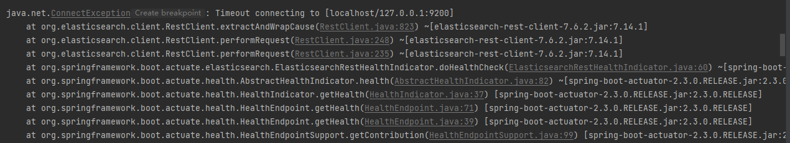
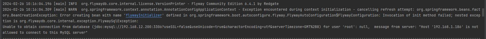
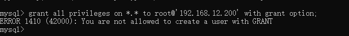
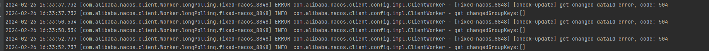

## 本地项目运行问题

### Timeout connecting to [localhost/127.0.0.1:9200]
要运行 user 项目需要先运行 Nacos 项目，因为需要拉取配置信息，在运行 Nacos 项目的时候出现以下这个问题：  
<div align="center"></div>

问题原因：  
在 pom 文件中引入了 spring-boot-starter-actuator 依赖，这个组件是 springboot 的核心组件之一，里面集成了 es，会进行 es 的健康检查。   

解决方法：   
取消对 es 的健康检查，在 properties 配置文件中添加：  
```yml
management:
  health:
    elasticsearch:
      enabled: false
```


## 云原生环境下运行项目问题

### 无法连接本地 MySQL 服务器，不允许访问
<div align="center"></div>

问题原因：mysql 默认不会开启本地 IP 连接的权限，需要手动开启。   

解决方法：  
1. 进入安装 mysql 的 bin 目录，执行 `mysql -uroot -p123456` 进入 mysql。
2. 可以通过 `select current_user` 查看登录的用户为哪一个。
3. 查看 mysql 库 user 表中登录用户的 `host` 值（即可以进行连接访问的主机/IP名称）。
4. 修改 `host` 值（以通配符 `%` 的内容增加主机/IP地址），也可以直接增加 IP 地址。若是通过命令行 `grant all privileges on *.* to '%';` 修改当前登录用户的权限出现以下问题，则可以手动去数据库中 mysql/user 表中修改。<div align="center"></div>

4. 输入 `flush privileges` 刷新权限。
5. 重新启动 mysql8.0 服务。
6. 可以用 Navicat 尝试通过 IP 地址连接 mysql。


### 无法连接本地 Redis 服务器，一直报错：Client On Error:write ECONNRESET Config right?
<div align="center"></div>

问题原因：redis 默认只允许本机访问，所以也要修改 redis IP 连接的权限。   

解决方法：修改 redis 目录下的 redis.windows.conf 文件。   
1. 将所有的 bind 信息全部屏蔽。 将 `bind 127.0.0.1` 修改为 `bind 0.0.0.0` 或者直接注释掉。  
2. 将 `protected-mode yes` 改为 `protected-mode no`。
3. 重新启动 redis 服务，注意要切换到带有指定配置文件的启动方式：`redis-server redis.windows.conf`。如果用 `redis-server` 直接启动，会因为没有指定配置文件，导致没有使用修改的配置文件。


### 连接 redis 出现错误：NOAUTH Authentication required。

问题原因：没有用密码登录认证。

解决方法：在 redis.windows.conf 文件中找到 `requirepass devel123456`，在连接时输入密码 `devel123456`。或者直接将这一行注释掉（推荐）。


### 项目启动后一直打印 Nacos 获取数据错误，状态码 504

<div align="center"></div>